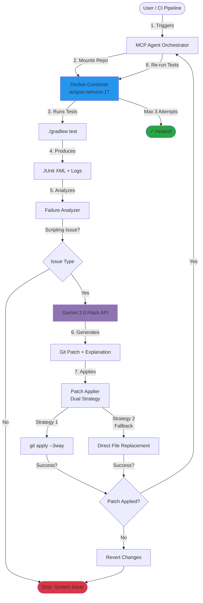
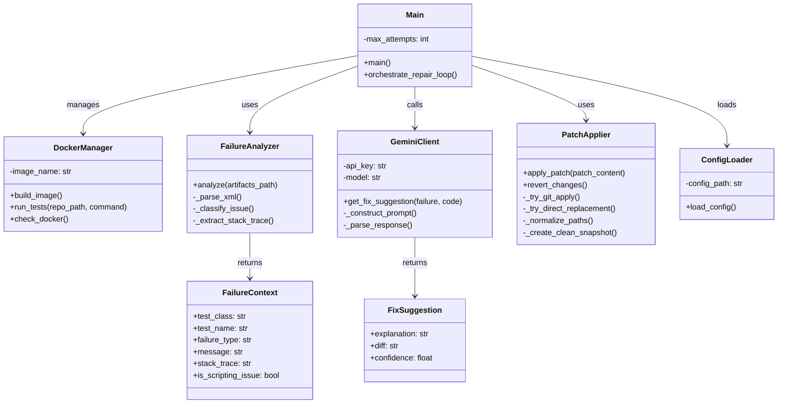
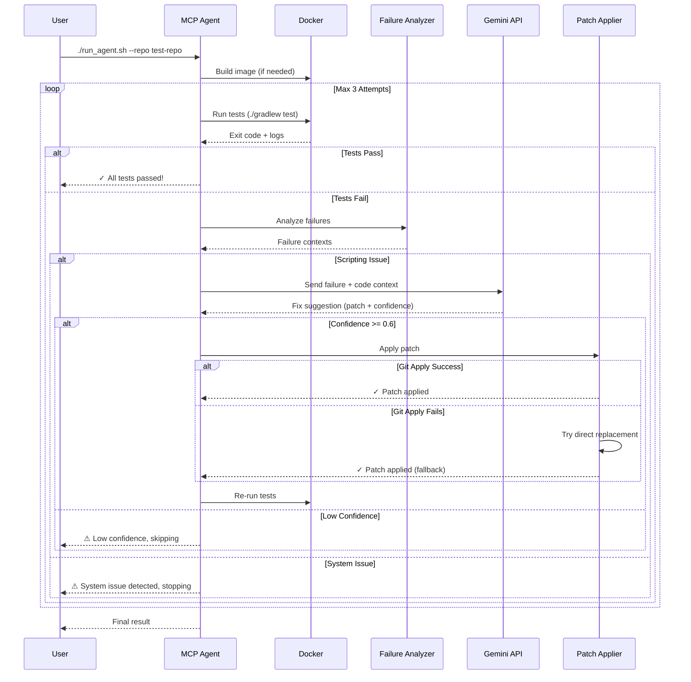

<div align="center">

# 🤖 REST Assured Self-Healing MCP Agent

[](https://www.python.org/downloads/)
[](https://www.docker.com/)
[](https://ai.google.dev/)
[](LICENSE)

**Automated Self-Healing for Java REST API Tests using Gemini AI**

[Features](#-features) • [Architecture](#️-architecture) • [Installation](#-installation--setup) • [Usage](#-usage) • [Examples](EXAMPLES.md)

</div>

---

## 🎯 Overview

The **REST Assured Self-Healing MCP Agent** is an intelligent automation tool that automatically diagnoses and fixes scripting issues in Java-based REST API test frameworks (RestAssured + TestNG). It leverages Google's Gemini AI to analyze test failures, generate precise code fixes, and verify repairs—all within an isolated Docker environment.

### Why Self-Healing?

- ⏱️ **Save Time**: Automatically fix common test failures without manual intervention
- 🔒 **Safe**: Runs in isolated Docker containers with automatic rollback on failure
- 🧠 **Smart**: Uses Gemini AI to understand context and generate precise fixes
- 🔄 **Iterative**: Automatically retries tests after applying fixes (up to 3 attempts)
- 📊 **Enterprise-Ready**: Handles complex multi-module projects with deep package hierarchies

---

## 🚀 Features

### Core Capabilities

- ✅ **Docker Isolation**: Runs tests in clean, ephemeral containers (`eclipse-temurin:17`)
- ✅ **Smart Diagnosis**: Distinguishes between scripting issues and system issues
- ✅ **Generative Repair**: Uses Gemini 2.0 Flash to analyze code and generate Git patches
- ✅ **Auto-Verification**: Applies patches and re-runs tests automatically
- ✅ **Safety First**: Reverts changes if patches fail or cause more issues
- ✅ **Dual Patch Strategy**: Git apply with direct file replacement fallback

### 🤖 Automated Git Workflow (New!)

**Stop worrying about AI breaking your `master` branch.** 🛡️

The agent acts like a responsible developer on your team. When it finds a fix, it follows a strict enterprise workflow:

1.  **Creates a Feature Branch**: `fix/self-healing-<test-name>-<timestamp>`
2.  **Applies the Fix**: Safely patches the code in isolation.
3.  **Verifies the Fix**: Runs the tests again to ensure it works.
4.  **Pushes & Creates PR**: Automatically opens a clear, descriptive **Pull Request** on GitHub.

**You stay in control.** You review the PR, approve the changes, and merge when ready. 🤝

### Supported Failure Types

The agent can diagnose and fix:

| Failure Type | Example | Fix Strategy |
|-------------|---------|--------------|
| **AssertionError** | Status code mismatch (expected 200, got 404) | Update assertion values |
| **NullPointerException** | Accessing null object | Add null checks |
| **NoSuchElementException** | Incorrect locators | Update selectors |
| **TimeoutException** | Insufficient wait times | Increase timeouts |
| **JsonParseException** | DTO field mismatches | Update DTO fields |
| **ArrayIndexOutOfBoundsException** | List access errors | Add bounds checks |

See [EXAMPLES.md](EXAMPLES.md) for detailed scenarios and fixes.

---

## 🏗️ Architecture

### High-Level Design (HLD)



### Low-Level Design (LLD)



### Workflow Diagram



---

## 📦 Installation & Setup

### Prerequisites

1. **Docker**: Must be installed and running
   ```bash
   docker info  # Verify Docker is running
   ```

2. **Python 3.8+**: Installed on your system
   ```bash
   python3 --version
   ```

3. **Gemini API Key**: Get your free key from [Google AI Studio](https://aistudio.google.com/app/apikey)

### Setup Steps

1. **Clone the Repository**
   ```bash
   git clone https://github.com/abhi9avx/rest-assured-self-healing-mcp.git
   cd rest-assured-self-healing-mcp
   ```

2. **Configure Environment**
   
   Create a `.env` file from the template:
   ```bash
   cp .env.example .env
   ```
   
   Edit `.env` and add your Gemini API key:
   ```bash
   GEMINI_API_KEY=your_actual_api_key_here
   ```

3. **Install Python Dependencies**
   ```bash
   python3 -m venv venv
   source venv/bin/activate  # On Windows: venv\Scripts\activate
   pip install -r requirements.txt
   ```

4. **Verify Installation**
   ```bash
   ./run_agent.sh --help
   ```

---

## 🏃 Usage

### Basic Usage

Run the agent on your Java test repository:

```bash
./run_agent.sh --repo path/to/your/java/repo
```

### Example: Test with Included Sample

```bash
./run_agent.sh --repo rest-api-test-example --test-filter GetUserTest
```

### Command-Line Options

| Option | Description | Default |
|--------|-------------|---------|
| `--repo <path>` | Path to target repository | **Required** |
| `--config <path>` | Custom config file | `config.yml` |
| `--no-docker-build` | Skip Docker image rebuild | `false` |
| `--test-filter <name>` | Run specific test class/method | All tests |

### Configuration (`config.yml`)

```yaml
max_attempts: 3                    # Max repair attempts per run
good_confidence_threshold: 0.6     # Minimum confidence to apply fix
allowed_paths:
  - src/test                       # Only allow changes in test directories
gemini_timeout_seconds: 60         # API timeout
```

---

## 📂 Project Structure

```
rest-assured-self-healing-mcp/
├── .env.example              # Environment template
├── .gitignore                # Git ignore rules
├── config.yml                # Agent configuration
├── run_agent.sh              # Entry point script
├── Dockerfile.agent          # Docker environment
├── requirements.txt          # Python dependencies
├── EXAMPLES.md               # Detailed usage examples
├── src/
│   ├── main.py               # Orchestrator
│   ├── config_loader.py      # Config management
│   ├── docker_manager.py     # Docker operations
│   ├── failure_analyzer.py   # Log parsing & classification
│   ├── gemini_client.py      # Gemini API integration
│   └── patch_applier.py      # Patch application (dual strategy)
└── rest-api-test-example/    # Sample test repository
    ├── src/test/java/        # Test files
    └── build.gradle          # Gradle config
```

---

## 🔧 How It Works

1. **Test Execution**: Runs your tests in a Docker container
2. **Failure Detection**: Parses JUnit XML reports to identify failures
3. **Classification**: Determines if failure is a scripting issue (fixable) or system issue
4. **AI Analysis**: Sends failure context + code to Gemini for analysis
5. **Patch Generation**: Gemini generates a Git-compatible patch
6. **Patch Application**: 
   - **Strategy 1**: Try `git apply --3way` for complex patches
   - **Strategy 2**: Fall back to direct file replacement for simple fixes
7. **Verification**: Re-runs tests to verify the fix
8. **Iteration**: Repeats up to 3 times or until tests pass

---

## 🛡️ Security

- ✅ `.env` file is **gitignored** by default
- ✅ API keys are **never committed** to the repository
- ✅ Tests run in **isolated Docker containers**
- ✅ Changes are **automatically reverted** on failure

---

## 🤝 Contributing

Contributions are welcome! Please follow these steps:

1. Fork the repository
2. Create a feature branch (`git checkout -b feature/amazing-feature`)
3. Commit your changes (`git commit -m 'Add amazing feature'`)
4. Push to the branch (`git push origin feature/amazing-feature`)
5. Open a Pull Request

---

## 📄 License

This project is licensed under the MIT License - see the [LICENSE](LICENSE) file for details.

---

## 👨‍💻 Author

**Abhinav Kumar**
- GitHub: [@abhi9avx](https://github.com/abhi9avx)
- LinkedIn: [Connect with me](https://linkedin.com/in/abhi9avx)

---

## 🙏 Acknowledgments

- [Google Gemini](https://ai.google.dev/) for the powerful AI capabilities
- [RestAssured](https://rest-assured.io/) for the excellent API testing framework
- [TestNG](https://testng.org/) for the robust testing framework

---

<div align="center">

**⭐ Star this repo if you find it useful!**

Made with ❤️ by [Abhinav Kumar](https://github.com/abhi9avx)

</div>
